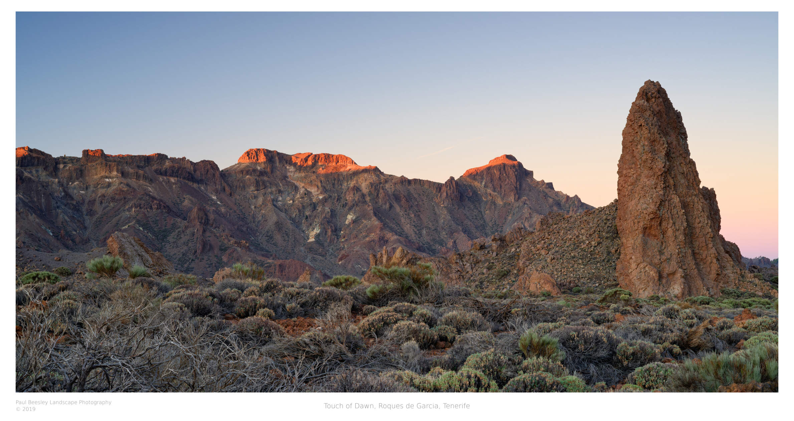

#  Fancy Borders 🖼️📷✨
A handy little tool for creating nice, uniform, scalable photo borders with text. Powered by Python with ImageMagick!

## Features
- Profile driven using TOML based configuration files
- Run multiple export profiles in a single command
- Customisable title, year and creator name
- Change your fonts, font colour and font weight
- Set colours for the border and text independently
- Supports resizing images during export
- Supports exporting to jpeg, png and tiff formats
- Selectable JPEG export quality

## Example Output


## Requirements
- Python 3.10+
- ImageMagick

Grab ImageMagick for your platform first as it's needed for the Wand library bindings:
- Windows: https://docs.wand-py.org/en/0.6.11/guide/install.html#install-imagemagick-on-windows
- Mac: https://docs.wand-py.org/en/0.6.11/guide/install.html#install-imagemagick-on-mac
- Linux: https://docs.wand-py.org/en/0.6.11/guide/install.html#install-imagemagick-on-debian-ubuntu

## Install / Run
1. Clone the repo
2. (Optional) Create a virtual environment: `python -m venv .venv`
3. Install required Python packages: `pip3 install -r ./requirements.txt`. Note that `pip3` might just be `pip` on your system.
4. Run a minimal command: `python .\border.py "C:\\Photography\\Export\\Full Border\\img014.jpg" "My Sample Caption" 2023`

Note that you will always need to provide at least the input file path, the image title and the year the image was taken. These arguments are positional. You can add the `--profiles` parameter to run a custom configuration, or several at once like: `--profiles default profile1 profile2`.

## Example Output
```
(.venv) PS C:\Photography\scripts> python .\border.py "C:\\Photography\\Export\\Full Border\\img014.jpg" "My Sample Caption" 2023 --profiles default                 
Running profile: default
        Input image:C:\Photography\Export\Full Border\img014.jpg
        Output image:C:\Photography\Export\Full Border\img014_b.jpg
        Input resolution: 6499x4874
        Saved output image successfully
All done!
```